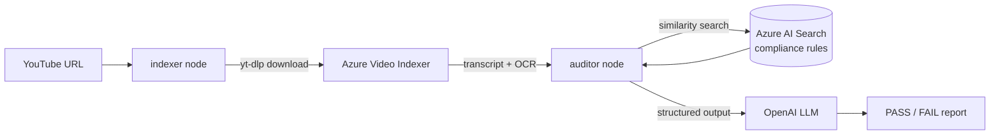

# Brand Guardian

A multimodal LLMOps pipeline that audits YouTube video ads for brand and regulatory compliance — orchestrated with **LangGraph**, served over **FastAPI**, observed with **Azure Monitor** and **LangSmith**, and grounded in a **RAG** knowledge base of your actual compliance documents.

Give it a video URL. It downloads the video, extracts the transcript and on-screen text via **Azure Video Indexer**, retrieves the relevant rules from **Azure AI Search**, and asks an LLM to render a structured PASS/FAIL verdict with cited violations — not a vague opinion.



## Why this exists

Most "AI compliance checker" demos just paste a transcript into a prompt and call it a day. This project is built like something you'd actually operate:

- **Structured, typed state** (`VideoAuditState`) flows through every node of the graph — no stringly-typed hand-offs.
- **RAG grounding is enforced, not assumed** — if the vector store returns zero rule chunks, the audit refuses to run rather than letting the LLM freelance an ungrounded verdict.
- **Errors are observable, not swallowed** — every node accumulates into a shared `errors` list that's returned all the way out through the API, so a failure three steps upstream (a bad download, an expired Azure token, a billing lapse) is visible in the response instead of a generic "skipped".
- **Telemetry and tracing are first-class** — Azure Monitor (via OpenTelemetry) instruments the API, and LangSmith traces every LLM call in the graph.

## Architecture

| Concern | Service | Notes |
|---|---|---|
| Orchestration | **LangGraph** | A 2-node state graph: `indexer` → `auditor` |
| Video transcript + OCR | **Azure Video Indexer** | ARM-based account; auth via `DefaultAzureCredential` |
| Video download | **yt-dlp** | Pulls the source video from a YouTube URL before upload |
| Compliance knowledge base | **Azure AI Search** | Vector index over your own rule PDFs, populated by `backend/scripts/index_documents.py` |
| LLM (chat + embeddings) | **OpenAI API** | Used in place of Azure OpenAI (see note below) |
| API layer | **FastAPI** | `POST /audit`, `GET /health` |
| Observability | **Azure Monitor** (OpenTelemetry) + **LangSmith** | Logs/metrics/traces to App Insights; LLM call tracing to LangSmith |
| Blob storage | **Azure Blob Storage** | Provisioned for asset storage |

> **Why OpenAI instead of Azure OpenAI?** This project was built without Azure OpenAI quota access. Every place that would normally call Azure OpenAI (chat completions, embeddings) instead calls the plain OpenAI API via `langchain-openai`'s `ChatOpenAI` / `OpenAIEmbeddings`. Swapping back to Azure OpenAI later is a small, contained change (new client + deployment names) since the rest of the graph doesn't care which backend produced the completion.

## Project structure

```
.
├── backend/
│   ├── data/                    # Source PDFs for the compliance knowledge base
│   ├── scripts/
│   │   └── index_documents.py   # Chunks + embeds the PDFs into Azure AI Search
│   └── src/
│       ├── api/
│       │   ├── server.py        # FastAPI app: POST /audit, GET /health
│       │   └── telemetry.py     # Azure Monitor / OpenTelemetry setup
│       ├── graph/
│       │   ├── state.py         # VideoAuditState — the typed state passed between nodes
│       │   ├── nodes.py         # indexer + auditor node implementations
│       │   └── workflow.py      # Builds and compiles the LangGraph graph
│       └── services/
│           └── video_indexer.py # Azure Video Indexer REST client + yt-dlp download
├── main.py                      # CLI entry point — runs one audit and prints the result
├── .env.example                 # All required environment variables (no real values)
└── pyproject.toml
```

## Setup

**Prerequisites:** Python 3.11+, [uv](https://docs.astral.sh/uv/), an Azure subscription with a Video Indexer account, Azure AI Search resource, and Azure Storage account, plus an OpenAI API key.

1. **Install dependencies**
   ```bash
   uv sync
   ```

2. **Configure environment**
   ```bash
   cp .env.example .env
   ```
   Fill in your own values. A few things worth calling out:
   - `AZURE_VI_LOCATION` must be the **ARM location slug** (e.g. `germanywestcentral`), not the Azure Portal display name (`Germany West Central`) — the Video Indexer REST API rejects the latter.
   - `AZURE_OPENAI_*` fields can stay empty if you don't have Azure OpenAI quota; the `OPENAI_*` fields are what the app actually uses.

3. **Authenticate to Azure**

   Video Indexer auth uses `DefaultAzureCredential`, which picks up your Azure CLI session automatically:
   ```bash
   az login
   ```

4. **Populate the compliance knowledge base**

   Drop your own compliance PDFs into `backend/data/`, then run:
   ```bash
   uv run python backend/scripts/index_documents.py
   ```
   This chunks each PDF, embeds it with OpenAI, and upserts it into your Azure AI Search index. **The audit will refuse to run if this index is empty** — that's intentional, so you never get an ungrounded verdict.

5. **Run it**

   As a one-off CLI simulation:
   ```bash
   uv run python -m main
   ```

   As an API server:
   ```bash
   uv run uvicorn backend.src.api.server:app --reload
   ```
   Then open `http://127.0.0.1:8000/docs` for the interactive Swagger UI.

## API

### `POST /audit`

```bash
curl -X POST http://127.0.0.1:8000/audit \
  -H "Content-Type: application/json" \
  -d '{"video_url": "https://youtu.be/VIDEO_ID"}'
```

```json
{
  "session_id": "...",
  "video_id": "vid_...",
  "status": "FAIL",
  "final_report": "The video contains a claim that...",
  "compliance_results": [
    {
      "severity": "MEDIUM",
      "category": "claim_validation",
      "description": "..."
    }
  ],
  "errors": []
}
```

`status` is one of `PASS`, `FAIL`, `SKIPPED` (no transcript could be extracted), or `ERROR` (a pipeline step failed). `errors` surfaces the real underlying exception whenever something upstream goes wrong, so failures are debuggable from the response alone instead of requiring log access.

### `GET /health`

Liveness check — returns `{"status": "ok"}`.

## Design notes / known trade-offs

- `/audit` runs the full pipeline synchronously (offloaded to a thread pool so it doesn't block FastAPI's event loop) and can take several minutes, since Video Indexer processing is polled until completion. A production version of this would return a job ID immediately and expose a separate status/polling endpoint rather than holding the HTTP connection open.
- Video download reliability depends on YouTube's CDN edge-node assignment for a given request, which occasionally times out; there's no retry-with-backoff around the download yet.

## Roadmap

- [ ] React frontend for submitting videos and viewing audit history
- [ ] Async job queue instead of a blocking `/audit` call
- [ ] Automated test coverage for the graph nodes and services
